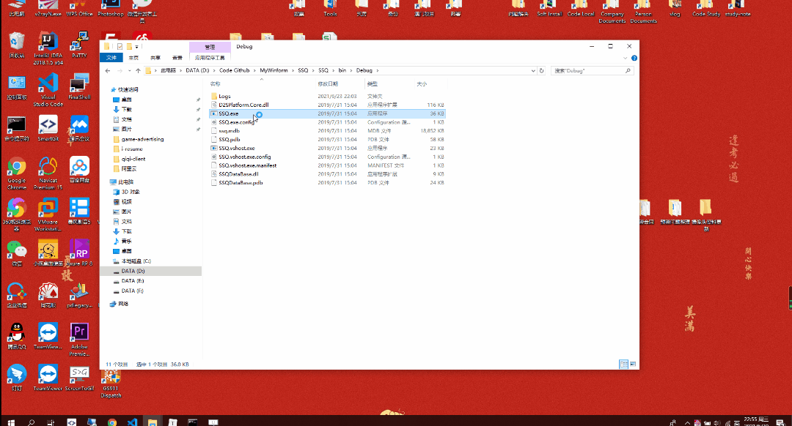

# 双色球概率统计

分析双色球出现概率，通过概率计算，提供中奖率，仅供娱乐。

## 功能点

+ 支持excel导入双色球数据
+ 支持手动添加双色球数据
+ 支持多种算法预测双色球中奖号码
+ 支持概率统计排序
+ 支持往期中奖金额计算

## 功能预览

## 双色球数据下载地址

双色球开奖记录导出excel <http://www.zhcw.com/kj/qg/ssq/wqcx/>